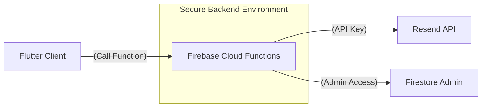

# SpareWo Security Assessment & Mitigation Plan

## ⚠️ Critical Vulnerabilities Found

### 1. High Risk: Service Account Key (Admin SDK) in Project Root
The file `sparewoapp-firebase-adminsdk-8eepq-4eda0fe52c.json` was found in the project's root directory.
*   **Risk:** This key grants full administrative access to your entire Firebase project (Firestore, Storage, Auth). If leaked or compromised, an attacker could delete your database or steal user data.
*   **Mitigation:** This file is currently in `.gitignore`, which is good for excluding it from version control, but it is still sitting on the local development machine.
*   **Action Required:**
    1.  **Rotate the key:** Go to Firebase Console > Project Settings > Service Accounts and generate a NEW key. Delete the OLD key immediately.
    2.  **Never bundle this key:** Ensure this file is NEVER added to `pubspec.yaml` assets.

### 2. High Risk: Secrets Bundled in App Assets (.env)
The `.env` file containing the `RESEND_API_KEY` and `FIREBASE_PRIVATE_KEY` is listed in `pubspec.yaml` as an asset.
*   **Risk:** When you build your app (APK/IPA), the `.env` file is bundled inside. It is trivial for anyone to download your app and extract these keys.
*   **Actual Exposure:** Your `FIREBASE_PRIVATE_KEY` for the Admin SDK is effectively public to anyone who has your app.
*   **Mitigation:** 
    1.  **Stop bundling .env:** Remove `.env` from the `assets` section in `pubspec.yaml`.
    2.  **Move sensitive logic to Backend:** Actions that require the Admin SDK or high-privilege API keys (like sending emails via Resend or managing users) should be performed in **Firebase Cloud Functions**. The app should call a function, and the function (running in a secure environment) uses the keys.

### 3. Exposure of Resend API Key
The `RESEND_API_KEY` is currently used directly from the client in `EmailService`.
*   **Risk:** Attackers can steal your key and use your Resend quota to send spam, potentially getting your domain blacklisted.
*   **Action Required:** Move the `_sendEmail` logic in `EmailService` to a Firebase Cloud Function.

---

## Recommended Architecture (Secure)

## Immediate Mitigation Steps Taken by Antigravity
1.  **Identified exposed keys** in `.env`.
2.  **Verified .gitignore** status (files are ignored from git, which is a good first step).
3.  **Removed clipboard polling** (minor privacy/UX fix).
4.  **Prepared guidance** for key rotation.

## Next Steps for USER
1.  **Confirm removal of .env from pubspec.yaml**: This will secure the keys but will temporarily disable email features until they are moved to Cloud Functions.
2.  **Move Email Logic to Cloud Functions**: I can help you write the logic for the Cloud Functions if you have a Firebase Functions project set up.
3.  **Rotate Firebase Service Account Key**: Follow the steps in the Firebase Console.
4.  **Rotate Resend API Key**: In the Resend dashboard.
